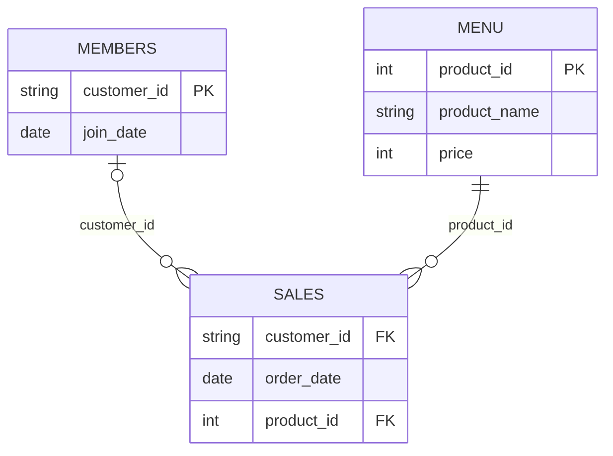

# 8 Week SQL Challenge 

## Case Study #1: Danny's Diner

`Case_1_Dannys_diner` dataset has `sales`, `menu`, and `members` tables. Danny wants to use the data to answer a few simple questions about his customers, especially their visiting patterns, how much money they've spent on the diner, and which items on the menu are their favorite. Below is the queries written in GoogleSQL to answer the questions.


### Entity Relationship Diagram



- `sales` is the transaction log, every row is one product ordered by one customer on one date
- `menu` gives each `product_id` its name and price
- `members` maps a `customer_id` to the date they joined the loyalty program.

---

## Overall Takeaways

- **Ramen is the staple product**: most purchased overall and favorite item of Customer A and C.
- **Customer A and B are loyal customers** (both are members); **C is a casual, infrequent customer** (2 visits, no membership) and spends the least.
- **Frequency vs. spend trade-off**: Customer B visits most often but in smaller amounts per visitm while C visits least often but spends more per visit. 
- **The points program rewards item choice and signup timing, not just raw spend**: Customer B earns more points than A over their whole purchase history just purely from buying more sushi, which carries the 2x multiplier. Separately, the first-week 2x bonus after joining (Question 10) further shifts the balance toward whoever's post-membership orders happened to land in that window. Together, this points program could push customers to become members and to spend more heavily right after signing up.
---

### 1. What is the total amount each customer spent at the restaurant?

```sql
SELECT
  s.customer_id,
  SUM(m.price) AS amount_spent
FROM Case_1_Dannys_diner.sales AS s
LEFT JOIN Case_1_Dannys_diner.menu AS m
  ON s.product_id = m.product_id
GROUP BY
  s.customer_id;
```

| customer_id | amount_spent |
|---|---|
| A | 66 |
| B | 64 |
| C | 36 |

=> Customer A spent the most at the diner of $66, closely followed by B at $64. Customer C spent roughly half as much.

---

### 2. How many days has each customer visited the restaurant?

```sql
SELECT
  customer_id,
  COUNT(DISTINCT order_date) AS days_visited
FROM Case_1_Dannys_diner.sales
GROUP BY customer_id;
```

| customer_id | days_visited |
|---|---|
| A | 4 |
| B | 6 |
| C | 2 |

=> Customer B visited the most often (6 days) despite spending slightly less in total than A, which means customer B tends to make smaller purchases per visit (based on Question 1). Customer C only visited the restaurant 2 times, implying larger spend per visit compared to Customer A and B

---

### 3. What was the first item from the menu purchased by each customer?

```sql
WITH RankedOrders AS (
  SELECT
    s.customer_id,
    m.product_name,
    DENSE_RANK() OVER (
      PARTITION BY s.customer_id
      ORDER BY s.order_date ASC
    ) AS order_number
  FROM Case_1_Dannys_diner.sales AS s
  LEFT JOIN Case_1_Dannys_diner.menu AS m
    ON s.product_id = m.product_id
)
SELECT
  customer_id,
  product_name AS first_item_purchased
FROM RankedOrders
WHERE order_number = 1;
```

| customer_id | first_item_purchased |
|---|---|
| A | sushi |
| A | curry |
| B | curry |
| C | ramen |
| C | ramen |

=> Customers A and C both bought more than one item on their very first visit. So Customer A had sushi and curry for their first items purchased, while Customer C had ramen twice. Only Customer B has one single item (curry).

---

### 4. What is the most purchased item on the menu and how many times was it purchased by all customers?

```sql
SELECT
  m.product_name,
  COUNT(s.product_id) AS purchased_times
FROM Case_1_Dannys_diner.sales AS s
LEFT JOIN Case_1_Dannys_diner.menu AS m
  ON s.product_id = m.product_id
GROUP BY m.product_name
ORDER BY purchased_times DESC
LIMIT 1;
```

| product_name | purchased_times |
|---|---|
| ramen | 8 |

=> Ramen is by far the diner's most popular dish overall, purchased 8 times across all customers. It should be a menu staple and a strong candidate for any loyalty/promo campaign.

---

### 5. Which item was the most popular for each customer?

```sql
WITH RankedPurchasedTime AS (
  SELECT
    s.customer_id,
    s.product_id,
    DENSE_RANK() OVER (
      PARTITION BY s.customer_id
      ORDER BY COUNT(s.product_id) DESC
    ) AS purchased_rank,
    m.product_name
  FROM Case_1_Dannys_diner.sales AS s
  LEFT JOIN Case_1_Dannys_diner.menu AS m
    ON s.product_id = m.product_id
  GROUP BY s.customer_id, s.product_id, m.product_name
)
SELECT
  customer_id,
  product_name AS most_purchased_product
FROM RankedPurchasedTime
WHERE purchased_rank = 1;
```

| customer_id | most_purchased_product |
|---|---|
| A | ramen |
| B | sushi |
| B | curry |
| B | ramen |
| C | ramen |

=> Ramen is clearly the favorite for both Customer A and C. However, Customer B shows a more varied taste that if we look closely, until this moment, Customer B purchased each item on the menu twice, adding up to the total spent of $64 in Question 1, so it is not yet clear if Customer B has any favorite item yet in the menu.

---

### 6. Which item was purchased first by the customer after they became a member?

```sql
WITH RankedOrderAfterMem AS (
  SELECT
    s.customer_id,
    s.product_id,
    DENSE_RANK() OVER (
      PARTITION BY s.customer_id
      ORDER BY s.order_date ASC
    ) AS order_number,
    m.product_name
  FROM Case_1_Dannys_diner.sales AS s
  LEFT JOIN Case_1_Dannys_diner.members AS mem
    ON s.customer_id = mem.customer_id
  LEFT JOIN Case_1_Dannys_diner.menu AS m
    ON s.product_id = m.product_id
  WHERE s.order_date >= mem.join_date
)
SELECT
  customer_id,
  product_name AS first_purchased_after_membership
FROM RankedOrderAfterMem
WHERE order_number = 1;
```

| customer_id | first_purchased_after_membership |
|---|---|
| A | curry |
| B | sushi |

=> Unlike their very first-ever order (Q3), A and B each have one unambiguous first purchase right after joining the loyalty program: curry for A, sushi for B. 

---

### 7. Which item was purchased just before the customer became a member?

```sql
WITH RankedOrderBeforeMem AS (
  SELECT
    s.customer_id,
    s.product_id,
    DENSE_RANK() OVER (
      PARTITION BY s.customer_id
      ORDER BY s.order_date DESC
    ) AS order_number,
    m.product_name
  FROM Case_1_Dannys_diner.sales AS s
  LEFT JOIN Case_1_Dannys_diner.members AS mem
    ON s.customer_id = mem.customer_id
  LEFT JOIN Case_1_Dannys_diner.menu AS m
    ON s.product_id = m.product_id
  WHERE s.order_date < mem.join_date
)
SELECT
  customer_id,
  product_name AS last_purchased_before_membership
FROM RankedOrderBeforeMem
WHERE order_number = 1;
```
| customer_id | last_purchased_before_membership |
|---|---|
| A | sushi |
| A | curry |
| B | sushi |


A ordered sushi and curry on the same day right before joining, while B's last pre-membership order was sushi, which was the same item B chose as their first purchase after joining. So here, it might hint sushi is Customer's B genuine favorite.However, as analyzed in question 5, until this moment, Customer B has purchased each item twice. So, we need to follow up on Customer B upcoming purchase to confirm if sushi is truly Customer B's favorite


---

### 8. What is the total items and amount spent for each member before they became a member?

```sql
SELECT
  s.customer_id,
  COUNT(s.product_id) AS total_items,
  SUM(m.price) AS total_spent
FROM Case_1_Dannys_diner.sales AS s
LEFT JOIN Case_1_Dannys_diner.members AS mem
  ON s.customer_id = mem.customer_id
LEFT JOIN Case_1_Dannys_diner.menu AS m
  ON s.product_id = m.product_id
WHERE s.order_date < mem.join_date
GROUP BY s.customer_id;
```

| customer_id | total_items | total_spent |
|---|---|---|
| A | 2 | 20 |
| B | 3 | 30 |


Customer B was already a more frequent, higher spending customer than Customer A before joining the membership program, both in item count and dollar amount. This suggest Customer B is a loyal member.

---

### 9. If each $1 spent equates to 10 points and sushi has a 2x points multiplier — how many points would each customer have?

```sql
SELECT
  s.customer_id,
  SUM(
    CASE
      WHEN m.product_name = 'sushi' THEN 2*10*m.price ELSE 10*m.price END) AS total_points
FROM Case_1_Dannys_diner.sales AS s
LEFT JOIN Case_1_Dannys_diner.menu AS m
  ON s.product_id = m.product_id
GROUP BY s.customer_id;
```

| customer_id | total_points |
|---|---|
| A | 760 |
| B | 840 |
| C | 360 |

=> Even though Customer A outspent Customer B in raw dollars in question 1 ($66 vs $64), Customer B ends up with more points (840 vs 760) here thanks to buying more sushi, which carries the 2x multiplier, as the loyalty program rewards item choice, not just spend.

---

### 10. In the first week after a customer joins the program (including their join date) they earn 2x points on all items, not just sushi — how many points do customer A and B have at the end of January?

```sql
SELECT
  s.customer_id,
  SUM(
    CASE
      WHEN s.order_date BETWEEN mem.join_date AND DATE_ADD(mem.join_date, INTERVAL 6 DAY) THEN 2*m.price*10
      WHEN m.product_name = 'sushi' THEN 2*m.price*10
      ELSE m.price *10
    END) AS total_points_by_end_Jan
FROM Case_1_Dannys_diner.sales AS s
INNER JOIN Case_1_Dannys_diner.members AS mem
  ON s.customer_id = mem.customer_id
LEFT JOIN Case_1_Dannys_diner.menu AS m
  ON s.product_id = m.product_id
WHERE s.order_date <= '2021-01-31'
GROUP BY s.customer_id;
```

| customer_id | total_points_by_end_Jan |
|---|---|
| A | 1220 |
| B | 720 |

=> Customer A's total points by the end of Jan are roughly 70% higher than Customer B's (1220 vs 720). This means the first-week bonus window dramatically favors A because A's post membership orders landed inside that bonus week, while more of B's points earning activity fell outside it. 


